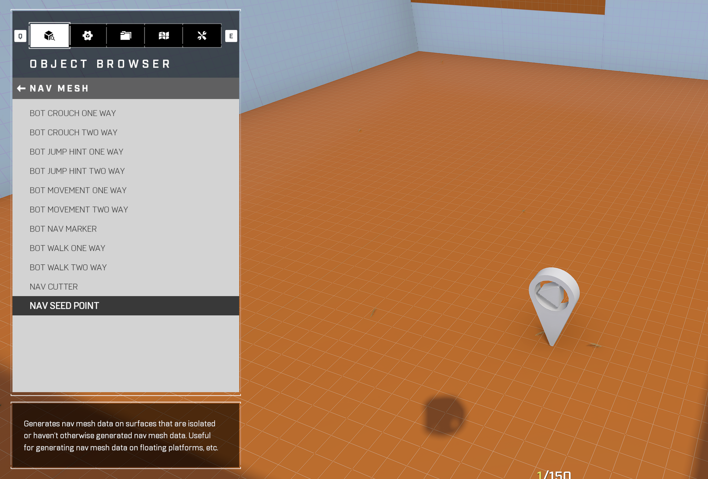
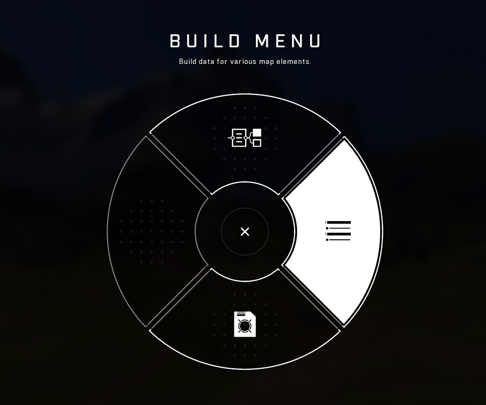
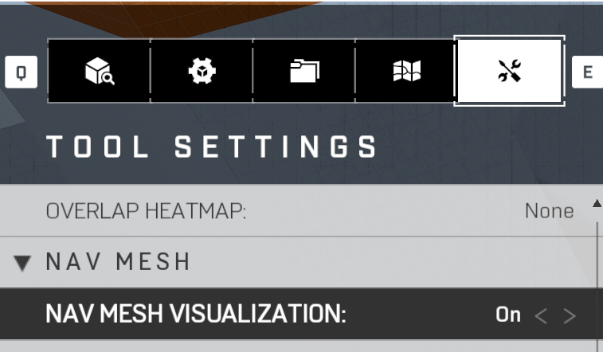
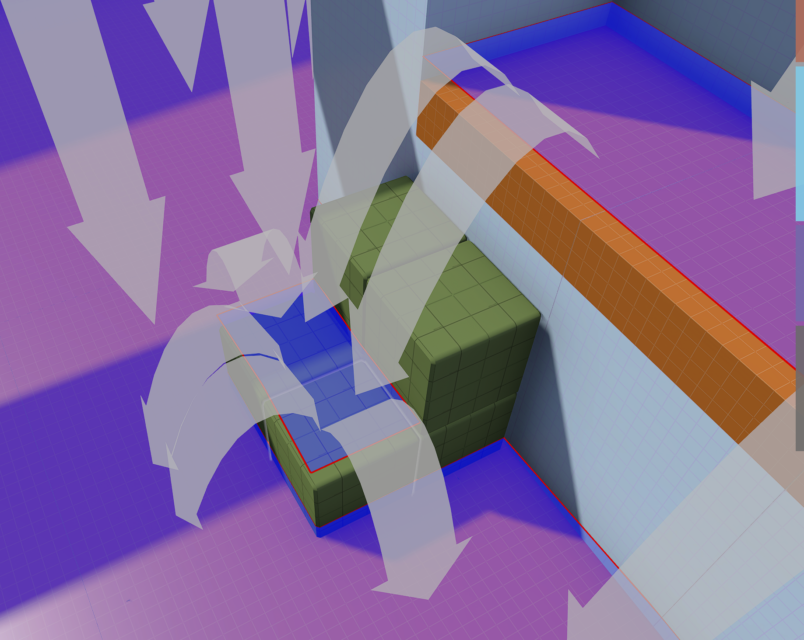
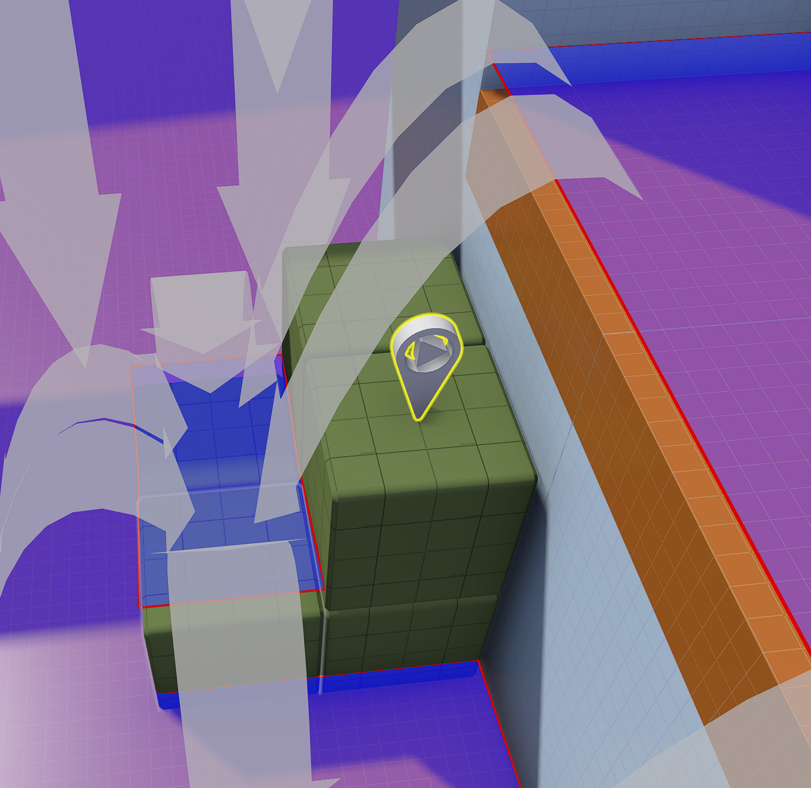
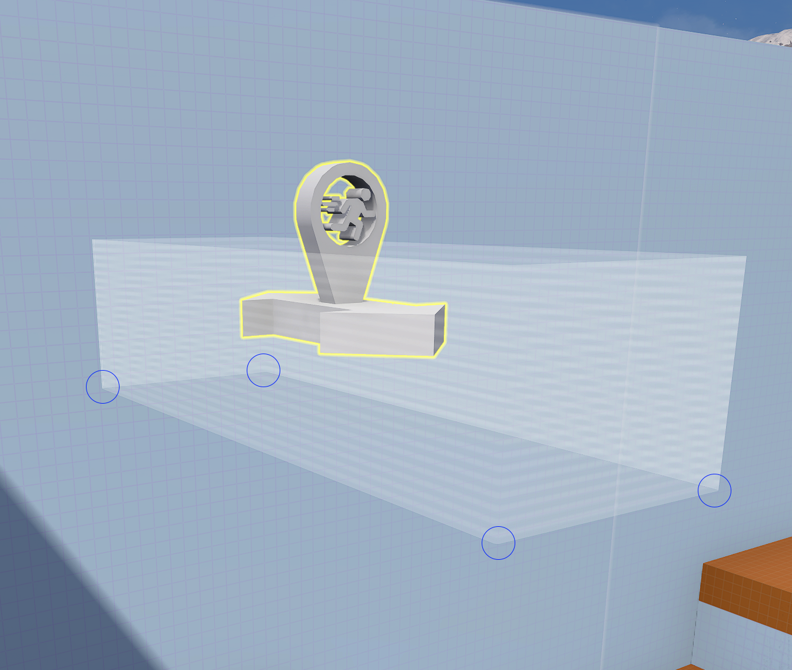
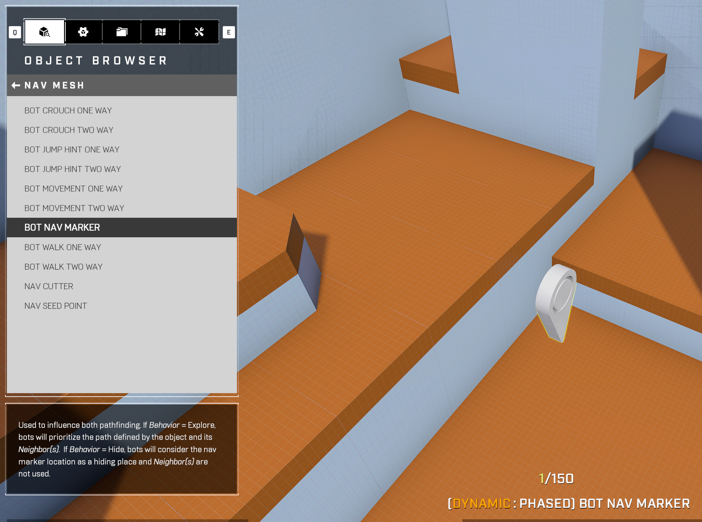
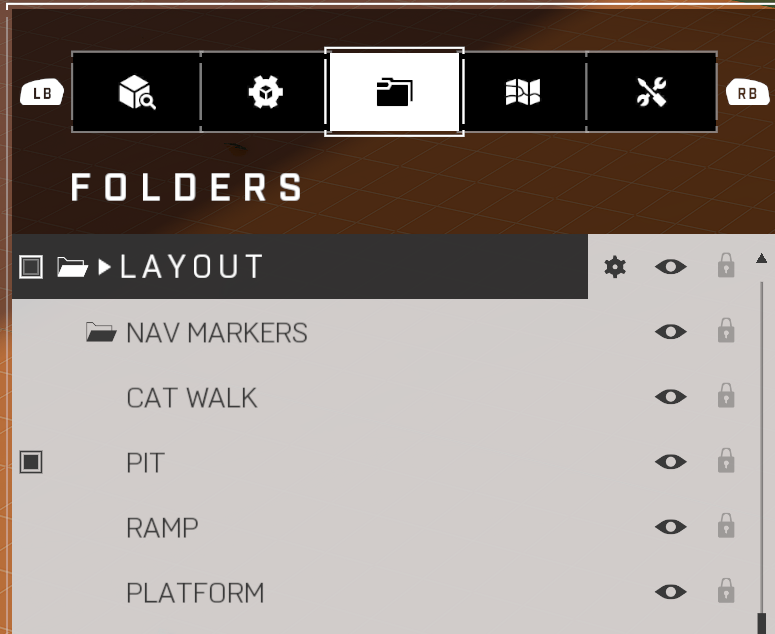
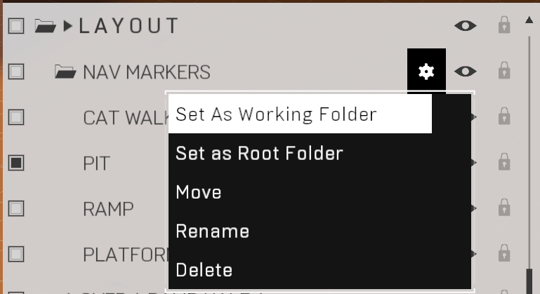
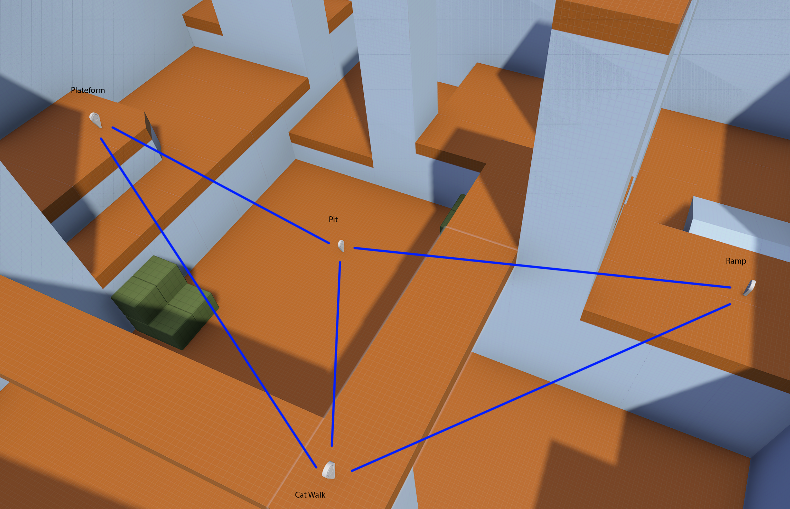

# How to Use Nav Mesh

## Description

Properly setup your Forge map that supports Bot gameplay.

## Required Objects

* [Nav Seed Point](../objects/gameplay/nav-mesh/nav-seed-point.md)
* [Jump Hint Two Way](../objects/gameplay/nav-mesh/bot-jump-hint-two-way.md)
* [Bot Nav Marker](../objects/gameplay/nav-mesh/bot-nav-marker.md)

## Steps

### Place Nav Seed Point in desired location.


If your forge map does not use the natural terrain of the forge canvas or if the base flooring is combination of natural terrain and forge pieces, placing a Nav Seed Point helps with Bots being playable on your forge map.


### Open the Build Menu and build Nav Mesh

* To get to the Build Menu, hold the **Y** button on the controller to access the Tools Menu and move the thumbstick to the right and select **Build Menu**
* Navigate down the list of build options, highlight **Nav Mesh** and then select **Build Selected** to build the Nav Mesh on the forge map.

### Turn on Nav Mesh Visualization.

* Open the Forge Menu and navigate over to **Tool Settings**.
* Scroll down through the list of tool settings to Nav Mesh Visualization and turn **On** the setting.


If you cannot see the Nav Mesh on your map, make sure your crosshairs are pointed towards the floor and not a wall.

If you still can't see the Nav Mesh, validate the Nav Seed Point is placed on the ground and rebuild the Nav Mesh data.



Validate Bot gameplay after initial Nav Mesh build, this is a good time to verify the all areas are fully populated for Bot movements.


### If extra Bot movement pathing is needed, it might be useful to place an extra Nav Seed Point.

* Placing another Nav Seed Point will help Bots to identify all intended playable spaces.

### Using Jump Hints to help Bot traversal movements

* If the intended jump hint was not built properly with the default Nav Mesh build, you can place either a Jump Hint One Way or Jump Hint Two Way to help Bots understand the intended jump spaces.

* When placing a Jump Hint, make sure the bottom corners of the volume are merged into the geo for the Jump Hint to populate properly.


Bots have a max jump height, so validate the jump hint is not too high or too far of a jump for the bot.


### Place and Name Bot Nav Markers for setting up neighbor options - Workflow Enhancement

* Place Bot Nav Markers around the map on points of interests

* Name each explore point uniquely so it's easier to find within the folders and when setting up the neighbor options for a better workflow experience.
  * If setting up each explore point uniquely isn't the best workflow for you, you can still use the default **Bot Nav Marker** and add a unique description to the location for identifiable reasons
* Another approach is by creating a separate folder in your 'Forge Menu - Folders', name the folder as **Nav Markers** and set that folder as your working folder.

 


When you're completed placing Nav Markers, to change your working folder so that you are not spawning unwanted objects in the incorrect folder.


### Setting up Neighbor Options


**What are Neighbor Options**

Neighbor Options is when the bot is navigating around the map and when gets to its destination point and it will then determine which next Bot Nav Marker it wants to go towards next.

If a bot requires a weapon, game mode objective or an enemy player they will prioritize objectives before heading towards the next location.

When testing or playing your map and if you see bots clustered in one location, it usually means the bots don't have another Nav Marker to go towards, objectives to complete or weapons they don't need on the on the map.


Once all the Nav markers have been properly placed and labeled, Neighbor Option can now be set up.

In the example below, you'll notice theres a Nav Marker location labeled the "Pit" set up as a point of interest for neighbors bots to explore next. Bots do not travel in a 'straight line' from one location to the next, the lines are just representative of the area the bots will explore next.

In a real map you will need to have more than just four Nav Markers set up and you will need to set up them up like intersections for roadway.

## Other Notes

1. Bots will also look for Item spawners on the map along with understanding objects.
2. Bots understand how to play objectives, for instance the bot will hide the Oddball or Flag if you have the Bot Nav Marker set to hidden for those Game Modes. Make the Bot Nav Markers are properly setup for the Game Modes by setting the labels to put **CTF Include** and set up the team for that hiding spot. This will help prevent the bot from hiding the stolen stolen flag in the enemy's base. When setting up for Oddball, set the **Oddball Include** label and set the team to **Neutral**.
